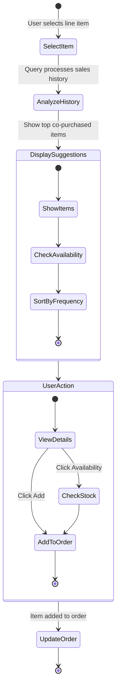

# Items Others Bought Extension for Business Central

This extension adds intelligent cross-selling suggestions to the Sales Order page in Business Central. It analyzes historical sales data to show items frequently purchased together, helping salespeople identify additional sales opportunities based on actual customer buying patterns.

## Features

- Real-time "Items Others Bought" factbox on Sales Order page
- Analysis of historical co-purchase patterns
- Direct view of item availability and prices
- One-click add to order functionality
- Automatic sorting by purchase frequency
- Live availability checks

## Technical Components

- Query 50090 "Item Cross Sales": Analyzes co-purchase patterns
- Page 50090 "Item Cross Sale Factbox": Displays suggestions
- PageExt 50091 "Sales Order Ext": Integrates factbox into Sales Order

## Process Flow

## Installation

1. Import the following objects:
   - `Query-50090-Item Purchase Analysis.al`
   - `Page-50090-Common-Items-Factbox.al`
   - `Pageext-Sales-Order.al`

2. Compile and publish the extension

## Usage

1. Open a Sales Order
2. Add or select a line item
3. View suggested items in the "Items Others Bought" factbox
4. Click "Add to Order" for any suggested items you want to include

## Technical Details

### Query Structure
The "Item Cross Sales" query analyzes sales history by:
1. Finding all orders containing the selected item
2. Identifying other items from those orders
3. Counting co-occurrence frequency
4. Sorting by frequency of appearance

### Performance Considerations
- Query uses inner joins for optimal performance
- Results are cached per sales line
- Availability checks are performed on-demand

## Development Setup

### Prerequisites
- Business Central Development Environment
- AL Language extension for VS Code
- Business Central Instance

### Configuration
No additional configuration required. The factbox integrates automatically with the Sales Order page.

## Contributing

1. Fork the repository
2. Create a feature branch
3. Commit your changes
4. Push to the branch
5. Create a Pull Request

## License

This project is licensed under the MIT License - see the LICENSE file for details
